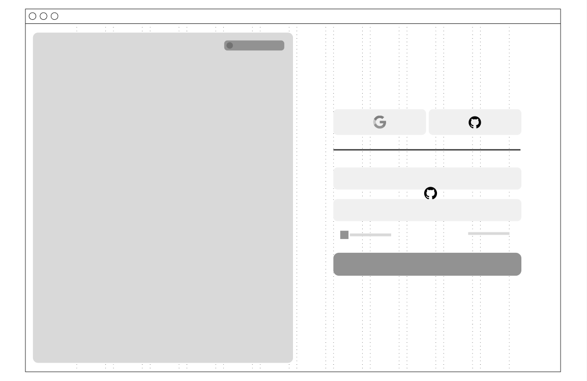
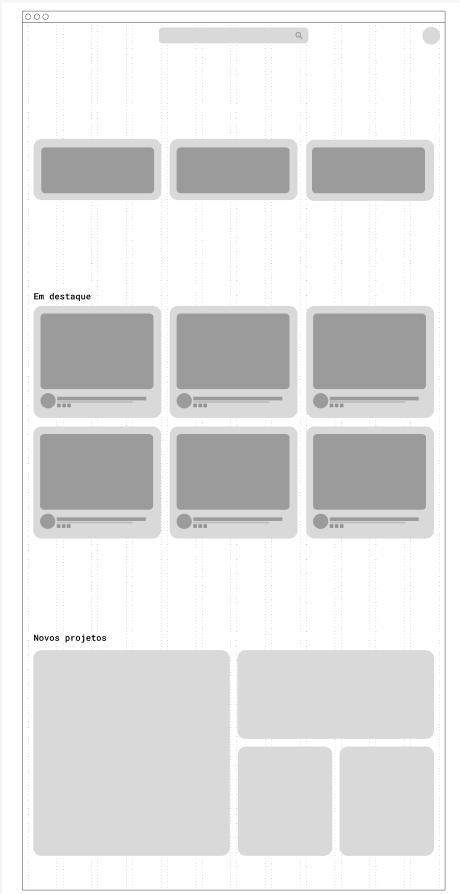
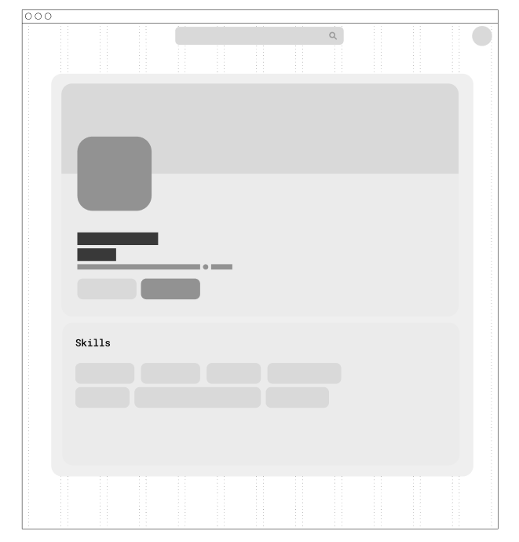
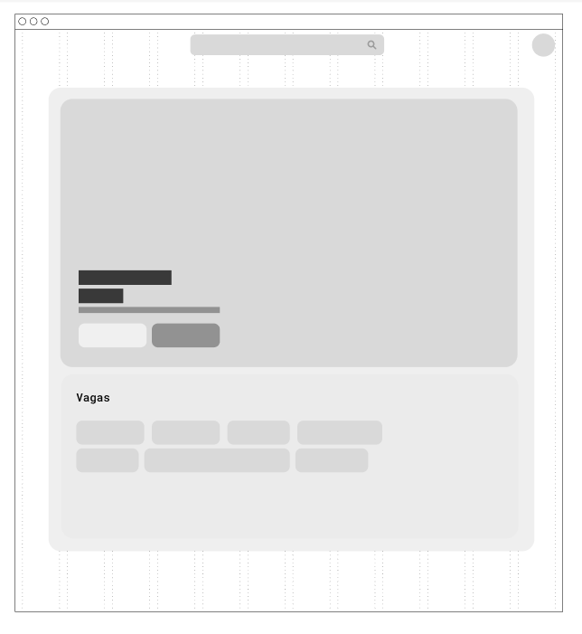
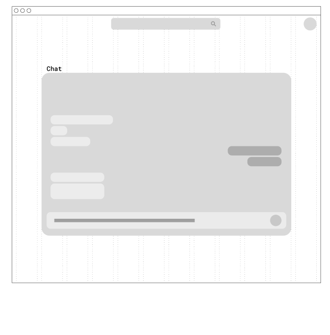
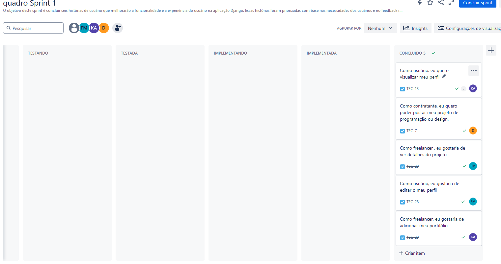

# TechJob 🚀

O TechJob será um aplicativo inovador voltado para profissionais de TI e design, projetado para conectar talentos a oportunidades de emprego e facilitar a criação de startups. O objetivo é oferecer uma plataforma completa que integra funcionalidades para networking, exibição de portfólios online e ferramentas de colaboração. Com uma interface intuitiva e fácil de usar, o TechConnect permite que profissionais atualizem e compartilhem seus portfólios, descubram e se conectem com empresas que buscam talentos, e colaborem em projetos estratégicos. A plataforma visa otimizar a busca por oportunidades de emprego, parcerias e desenvolvimento de novas ideias, proporcionando um ambiente dinâmico e eficiente para todos os envolvidos no mercado de tecnologia e design.

## Manual de uso 📖

## Requisitos 📋

Para executar este projeto, você precisará das seguintes ferramentas e versões:

- **Python**: 3.6 ou superior. [Python](https://www.python.org/downloads/)
- **Django**: 3.2 ou superior. [Django](https://www.djangoproject.com/)
- **Pillow**: _python -m pip install Pillow_
- **SQLite**: (incluso com Python, não precisa de instalação separada)
- **GitHub**: Para controle de versão e colaboração. [GitHub](https://github.com/)
- **Jira**: Para gerenciamento de projetos e tarefas. [Jira](https://www.atlassian.com/software/jira)

## Links 🔗
- https://cesar-team-cl0vsbag.atlassian.net/jira/software/projects/TEC/boards/1/backlog?assignee=unassigned
- https://www.figma.com/design/wy3al55ytbCJGAoTPjeKyI/Untitled?node-id=0-1&node-type=canvas&t=1Z0sYzX13y6Dh0xm-0
- https://youtu.be/qymdWopGE-o (Screencast) Entrega 1
- https://youtu.be/Gpn5T3saxH8 (Screencast) Entrega 3

## Entregas 📦

### Semana 1

**Backlog das histórias**

**Protótipos Lo-Fi**

#### Tela de Login

#### Front Page

#### Perfil do Usuário

#### Perfil da Empresa

#### Chat

### Entrega 3

### Sprint 1

## Desenvolvido por:

- [Caio Augusto](https://github.com/CaioAugustoMachadoDeMelo) - camm@cesar.school
- [Davi Santiago](https://github.com/Davicas01) - dscpr@cesar.school
- [Felipe Gonçalves Moxotó](https://github.com/Moxoto2k) - fgm@cesar.school
- [Kaike Campos](https://github.com/Kaik-e) - kcma@cesar.school 

